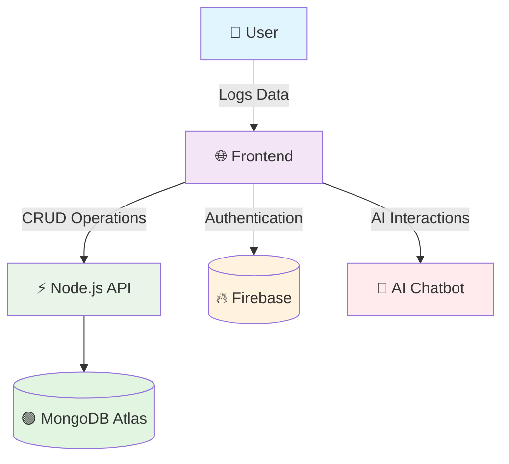

<h1 align="center">🏋️‍♂️ Fitness Tracker Dashboard</h1>

  
  
  
  
  
  

  ✨ Modern 3D-inspired fitness tracker with analytics, themes, AI, and database support ✨

---

## ✨ Features

| 🏃‍♂️ Activity Tracking | 📊 Analytics & Insights | 🎨 User Experience |
|----------------------|-------------------------|---------------------|
| ✔️ Log workouts with details | ✔️ Auto-update stats & progress | ✔️ Dark/Light mode toggle |
| ✔️ Multiple exercise types | ✔️ Interactive charts & history | ✔️ Responsive design |
| ✔️ Duration & calorie tracking | ✔️ Progress visualization | ✔️ Smooth animations |

| 🤖 Smart Features | 🔒 Security & Data | 🔄 Sync & Storage |
|-------------------|---------------------|-------------------|
| ✔️ Motivational AI tips | ✔️ Firebase Authentication | ✔️ Offline (localStorage) |
| ✔️ AI Chatbot coach | ✔️ Secure data handling | ✔️ Online (MongoDB) sync |
| ✔️ Personalized recommendations | ✔️ User profiles | ✔️ Data export ready |

---

## 📊 System Architecture

🛠️ Getting Started
🔽 Setup & Run Locally

 
<b>Click to expand setup instructions</b>

bash
# 1. Clone repository
git clone https://github.com/your-username/fitness-tracker-dashboard.git
cd fitness-tracker-dashboard

# 2. Open directly in browser
open index.html

# OR run with live-server for better development experience
npm install -g live-server
live-server

# For full setup with backend:
cd backend
npm install
npm start

📦 Project Structure
text
fitness-tracker-dashboard/
│
├── 🏠 index.html          # Main application entry point
├── 🎨 style.css           # Custom styles and 3D effects
├── ⚡ script.js           # Core application logic
├── 🔧 config/             # Configuration files
│   ├── firebase-config.js
│   └── database-config.js
├── 🖼️ assets/             # Images, icons, and media
│   ├── icons/
│   ├── images/
│   └── fonts/
├── 📱 components/         # Reusable UI components
│   ├── workout-form.js
│   ├── charts.js
│   └── ai-chatbot.js
└── 🔒 backend/            # Node.js API (if applicable)
    ├── server.js
    ├── routes/
    └── models/
🔧 Configuration
🟢 MongoDB Integration

 
<b>Database Operations</b>

javascript
// Save workouts to MongoDB
async function saveWorkouts(workouts) {
  try {
    const response = await fetch("/api/workouts", {
      method: "POST",
      headers: { "Content-Type": "application/json" },
      body: JSON.stringify(workouts)
    });
    
    if (!response.ok) throw new Error('Failed to save workouts');
    return await response.json();
  } catch (error) {
    console.error("❌ Database error:", error);
    // Fallback to localStorage
    localStorage.setItem('workouts', JSON.stringify(workouts));
  }
}

// Fetch workout history
async function loadWorkouts() {
  try {
    const response = await fetch("/api/workouts");
    return await response.json();
  } catch (error) {
    console.warn("⚠️ Using cached data");
    return JSON.parse(localStorage.getItem('workouts') || '[]');
  }
}

🔥 Firebase Authentication

 
<b>User Management</b>

javascript
import { getAuth, signInWithEmailAndPassword, createUserWithEmailAndPassword } from "firebase/auth";

// Initialize Firebase Auth
const auth = getAuth();

// User Sign Up
async function signUp(email, password) {
  try {
    const userCredential = await createUserWithEmailAndPassword(auth, email, password);
    console.log("✅ Account created", userCredential.user);
    return userCredential.user;
  } catch (error) {
    console.error("❌ Signup error", error);
    throw error;
  }
}

// User Sign In
async function signIn(email, password) {
  try {
    const userCredential = await signInWithEmailAndPassword(auth, email, password);
    console.log("✅ Logged in successfully", userCredential.user);
    return userCredential.user;
  } catch (error) {
    console.error("❌ Login error", error);
    throw error;
  }
}

📊 Data Models
Workout Object Schema
json
{
  "id": 1696754829157,
  "type": "Cardio",
  "date": "2025-10-08",
  "duration": 45,
  "calories": 320,
  "notes": "Felt great today!",
  "userId": "firebase-unique-id",
  "createdAt": "2025-10-08T14:32:00Z",
  "updatedAt": "2025-10-08T14:32:00Z"
}
User Profile Schema
json
{
  "uid": "firebase-unique-id",
  "email": "user@example.com",
  "name": "Prince Garg",
  "preferences": {
    "theme": "dark",
    "measurementUnit": "metric",
    "weeklyGoal": 5
  },
  "fitnessStats": {
    "totalWorkouts": 47,
    "totalCalories": 12500,
    "streak": 12
  },
  "createdAt": "2025-10-08T14:32:00Z",
  "lastLogin": "2025-10-15T09:45:00Z"
}
🔮 Development Roadmap
✅ Completed
LocalStorage offline functionality

Basic workout logging

Responsive UI with Bootstrap 5

Chart.js integration for analytics

🔄 In Progress
MongoDB backend integration

Firebase Authentication system

Real-time data synchronization

🚧 Planned Features
AI Chatbot fitness coach 🤖

Advanced analytics & insights

Social sharing capabilities

Mobile app development

Export functionality (CSV/Excel/PDF)

Workout templates & plans

Integration with wearable devices

🎯 Future Vision
Machine learning recommendations

Virtual personal trainer

Community challenges

Nutrition tracking integration

🎨 UI/UX Features

Feature	Description	Status
3D Card Effects	Modern glassmorphism design	✅ Implemented
Dark/Light Theme	User preference persistence	✅ Implemented
Smooth Animations	CSS transitions & keyframes	✅ Implemented
Progress Visualizations	Interactive charts & graphs	✅ Implemented
Responsive Design	Mobile-first approach	✅ Implemented

🤝 Contributing
We welcome contributions! Please feel free to submit pull requests or open issues for bugs and feature requests.

Fork the repository

Create your feature branch (git checkout -b feature/AmazingFeature)

Commit your changes (git commit -m 'Add some AmazingFeature')

Push to the branch (git push origin feature/AmazingFeature)

Open a Pull Request

👨‍💻 Author

Prince Garg
🌐 GitHub •
💼 LinkedIn •
📧 your.email@example.com
"Building innovative solutions to help people achieve their fitness goals"

📄 License
This project is licensed under the MIT License - see the LICENSE.md file for details.
