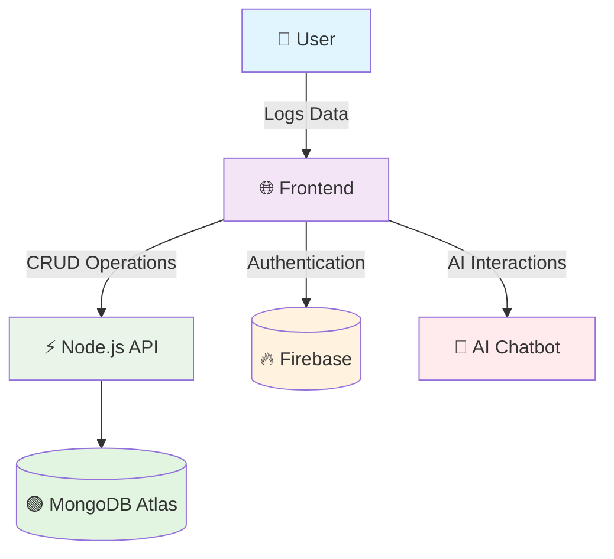

<h1 align="center">🏋️‍♂️ Fitness Tracker Dashboard</h1>

  
  
  
  
  
  

  ✨ Modern 3D-inspired fitness tracker with analytics, themes, AI, and database support ✨

---

## ✨ Features

| 🏃‍♂️ Activity Tracking | 📊 Analytics & Insights | 🎨 User Experience |
|----------------------|-------------------------|---------------------|
| ✔️ Log workouts with details | ✔️ Auto-update stats & progress | ✔️ Dark/Light mode toggle |
| ✔️ Multiple exercise types | ✔️ Interactive charts & history | ✔️ Responsive design |
| ✔️ Duration & calorie tracking | ✔️ Progress visualization | ✔️ Smooth animations |

| 🤖 Smart Features | 🔒 Security & Data | 🔄 Sync & Storage |
|-------------------|---------------------|-------------------|
| ✔️ Motivational AI tips | ✔️ Firebase Authentication | ✔️ Offline (localStorage) |
| ✔️ AI Chatbot coach | ✔️ Secure data handling | ✔️ Online (MongoDB) sync |
| ✔️ Personalized recommendations | ✔️ User profiles | ✔️ Data export ready |

---

## 📊 System Architecture

---
## 🚀 Quick Start

**🎯 Live Demo: [https://garg-fitness-tracker.netlify.app/](https://garg-fitness-tracker.netlify.app/)**

  <h3>🎪 Setup & Run Locally</h3>
  
<em>Get up and running in under 5 minutes! 🚀</em>

### 🛠️ Prerequisites
- Modern web browser (Chrome, Firefox, Safari)
- Code editor (VS Code recommended)
- Node.js (optional, for live server)

### ⚡ Quick Setup

# 🎯 One-command setup
git clone https://github.com/your-username/fitness-tracker-dashboard.git && cd fitness-tracker-dashboard

# 🌐 Open directly in browser (Simplest!)
open index.html

# 🔥 Enhanced development experience
npm install -g live-server
live-server --port=3000 --browser=chrome
🎨 For Full Stack Development
bash
# Backend setup (MongoDB + API)
cd backend
npm install

# Environment configuration
cp .env.example .env
# Add your MongoDB Atlas & Firebase keys

# Start development servers
npm run dev
📱 Mobile Testing
bash
# Test on mobile devices
npm install -g browser-sync
browser-sync start --server --files "**/*.css, **/*.js, **/*.html" --port 8080

🏗️ Project Structure

https://img.shields.io/badge/Architecture-Modern-blue?style=for-the-badge&logo=github

graphql
fitness-tracker-dashboard/
├── 🎯 Frontend Core
│   ├── 🏠 index.html          # Single Page Application
│   ├── 🎨 style.css           # 3D Glassmorphism Styles
│   ├── ⚡ script.js           # Progressive Web App Logic
│   └── 🎭 animations.css      # Smooth Transitions
│
├── 🔧 Configuration
│   ├── ⚙️ firebase-config.js  # Authentication Setup
│   ├── 🗄️ database-config.js # MongoDB Connection
│   └── 🌐 api-endpoints.js   # REST API Configuration
│
├── 🎨 Assets & Media
│   ├── 🎴 icons/              # SVG & Font Icons
│   ├── 🖼️ images/            # Workout & UI Images
│   ├── 🔤 fonts/              # Custom Typography
│   └── 🎵 sounds/             # Audio Feedback
│
├── 🧩 Components
│   ├── 📝 workout-form.js     # Exercise Logger
│   ├── 📊 charts.js           # Data Visualization
│   ├── 🤖 ai-chatbot.js       # Fitness Assistant
│   └── 🎯 progress-tracker.js # Goal Monitoring
│
├── 🔥 Backend (Node.js)
│   ├── 🚀 server.js           # Express Server
│   ├── 🛣️ routes/
│   │   ├── workouts.js        # CRUD Operations
│   │   └── users.js           # Profile Management
│   └── 📦 models/
│       ├── Workout.js         # Data Schema
│       └── User.js            # User Profile
│
└── 📚 Documentation
    ├── 📖 README.md           # Project Guide
    ├── 🎬 DEMO.md             # Live Examples
    └── 🔌 API.md              # Integration Guide
⚙️ Configuration & Integration

https://img.shields.io/badge/Stack-MERN_Fullstack-orange?style=for-the-badge
https://img.shields.io/badge/Database-MongoDB_Atlas-green?style=for-the-badge&logo=mongodb
https://img.shields.io/badge/Auth-Firebase-yellow?style=for-the-badge&logo=firebase

🗄️ MongoDB Integration

 
 <h4>🌐 Cloud Database Setup</h4> 
<em>Real-time data persistence with MongoDB Atlas</em>
 

javascript
// 📦 Database Service Layer
class WorkoutService {
  constructor() {
    this.API_BASE = 'https://your-api.herokuapp.com/api';
  }

  // 💾 Save workout with offline fallback
  async saveWorkout(workoutData) {
    try {
      const response = await fetch(`${this.API_BASE}/workouts`, {
        method: 'POST',
        headers: {
          'Content-Type': 'application/json',
          'Authorization': `Bearer ${this.getToken()}`
        },
        body: JSON.stringify(workoutData)
      });
      
      if (!response.ok) throw new Error('🚫 Network response not ok');
      
      const savedWorkout = await response.json();
      this.syncLocalStorage(savedWorkout); // 🔄 Sync cache
      return savedWorkout;
      
    } catch (error) {
      console.warn('🌐 Offline mode: Using localStorage');
      return this.saveToLocalStorage(workoutData);
    }
  }

  // 📥 Load workouts with smart caching
  async loadWorkouts(userId) {
    // Implementation details...
  }
}

🔐 Firebase Authentication

 
 <h4>🔒 Secure User Management</h4> 
<em>Enterprise-grade authentication system</em>
 

javascript
// 🔥 Firebase Auth Manager
class AuthManager {
  constructor() {
    this.auth = getAuth();
    this.setupAuthListeners();
  }

  // 👤 User Registration with Validation
  async registerUser({ email, password, name }) {
    try {
      const userCredential = await createUserWithEmailAndPassword(
        this.auth, email, password
      );
      
      // 🎉 Welcome new user
      await this.createUserProfile(userCredential.user, name);
      this.showSuccessNotification(`Welcome ${name}! 🎉`);
      
      return userCredential.user;
    } catch (error) {
      this.handleAuthError(error);
      throw error;
    }
  }

  // 🔑 Smart Login System
  async loginUser(email, password) {
    // Implementation with session management...
  }
}

📊 Data Models & Schemas

https://img.shields.io/badge/Data-Models_&_Schemas-blueviolet?style=for-the-badge&logo=json

🏃‍♂️ Workout Object Schema
json
{
  "💪 Workout": {
    "id": "1696754829157",
    "type": "Cardio", 
    "category": ["🏃‍♂️ Cardio", "💪 Strength", "🧘‍♀️ Flexibility", "⚡ HIIT"],
    "date": "2025-10-08",
    "duration": 45,
    "calories": 320,
    "intensity": "🔥 High",
    "notes": "Felt great today! 💪",
    "userId": "firebase-unique-id",
    "createdAt": "2025-10-08T14:32:00Z",
    "updatedAt": "2025-10-08T14:32:00Z",
    "tags": ["morning-workout", "outdoor", "personal-best"],
    "metrics": {
      "heartRate": 145,
      "distance": 5.2,
      "reps": 0,
      "sets": 0
    }
  }
}
👤 User Profile Schema
json
{
  "🎯 User Profile": {
    "uid": "firebase-unique-id",
    "personal": {
      "email": "user@example.com",
      "name": "Prince Garg",
      "avatar": "👨‍💻",
      "birthDate": "1995-08-15",
      "fitnessLevel": "🏋️‍♂️ Intermediate"
    },
    "preferences": {
      "theme": "dark",
      "measurementUnit": "metric",
      "weeklyGoal": 5,
      "notifications": true,
      "privacy": "public"
    },
    "fitnessStats": {
      "totalWorkouts": 47,
      "totalCalories": 12500,
      "currentStreak": 12,
      "longestStreak": 21,
      "achievements": ["🔥 10-workout streak", "🎯 5k calorie burn"]
    },
    "goals": {
      "weeklyWorkouts": 5,
      "targetWeight": 75,
      "targetCalories": 1500
    },
    "timestamps": {
      "createdAt": "2025-10-08T14:32:00Z",
      "lastLogin": "2025-10-15T09:45:00Z",
      "lastWorkout": "2025-10-14T18:30:00Z"
    }
  }
}
🗺️ Development Roadmap

https://img.shields.io/badge/Project-Roadmap-ff69b4?style=for-the-badge&logo=roadmap
https://img.shields.io/badge/Progress-65%2525-yellow?style=for-the-badge

✅ Completed & Live

https://img.shields.io/badge/%F0%9F%9A%80_Live_on_Netlify-available-success?style=flat-square

🎯 Core Platform

✅ Single Page Application Architecture

✅ Progressive Web App (PWA) Features

✅ Responsive Bootstrap 5 Design

✅ LocalStorage Offline Functionality

📊 Analytics & UI

✅ Chart.js Integration with Real-time Updates

✅ 3D Glassmorphism Design System

✅ Dark/Light Theme Toggle

✅ Smooth CSS Animations & Transitions

🏃‍♂️ Fitness Features

✅ Workout Logging & History

✅ Calorie & Progress Tracking

✅ Interactive Data Visualizations

🔄 In Development

https://img.shields.io/badge/%F0%9F%94%84_Active_Development-orange?style=flat-square

🗄️ Backend Integration

🔄 MongoDB Atlas Cloud Database

🔄 Express.js RESTful API

🔄 Real-time Data Synchronization

🔐 Authentication

🔄 Firebase Authentication System

🔄 User Session Management

🔄 Secure API Endpoints

🚧 Planned Features

https://img.shields.io/badge/%F0%9F%93%85_Coming_Soon-blue?style=flat-square

Feature	Status	ETA	Impact
🤖 AI Fitness Coach	🎯 Planned	Q4 2024	⭐⭐⭐⭐⭐
📱 Mobile App	🚧 Design	Q1 2025	⭐⭐⭐⭐⭐
📊 Advanced Analytics	🔄 Research	Q4 2024	⭐⭐⭐⭐
👥 Social Features	🎯 Planned	Q2 2025	⭐⭐⭐⭐
📤 Export (CSV/PDF)	🚧 Development	Q1 2025	⭐⭐⭐
🏋️‍♂️ Workout Templates	🎯 Planned	Q4 2024	⭐⭐⭐
⌚ Wearable Integration	🔄 Research	Q3 2025	⭐⭐⭐
🌟 Future Vision

https://img.shields.io/badge/%F0%9F%94%AE_Future_Vision-purple?style=flat-square

🤖 Machine Learning Recommendations

Personalized workout plans

Injury prevention alerts

Progress prediction algorithms

🎯 Virtual Personal Trainer

Real-time form correction

Voice-guided workouts

AR/VR integration

👥 Community Challenges

Global fitness competitions

Social accountability groups

Leaderboard system

🍎 Nutrition Tracking Integration

Meal planning

Macro tracking

Recipe suggestions

🎨 UI/UX Excellence

https://img.shields.io/badge/Design-UI/UX_First-ff69b4?style=for-the-badge&logo=adobexd

Feature	Description	Status	Impact
🎴 3D Card Effects	Modern glassmorphism with depth	✅ Implemented	🎨 High
🌙 Dark/Light Theme	System preference detection	✅ Implemented	👁️ High
✨ Smooth Animations	60fps CSS transitions & keyframes	✅ Implemented	⚡ High
📈 Progress Visualizations	Interactive charts & graphs	✅ Implemented	📊 High
📱 Responsive Design	Mobile-first progressive enhancement	✅ Implemented	🌐 Critical
🤝 Contributing

https://img.shields.io/badge/%F0%9F%A4%9D_Contributions_Welcome-success?style=for-the-badge
https://img.shields.io/badge/PRs-Welcome-brightgreen?style=for-the-badge

